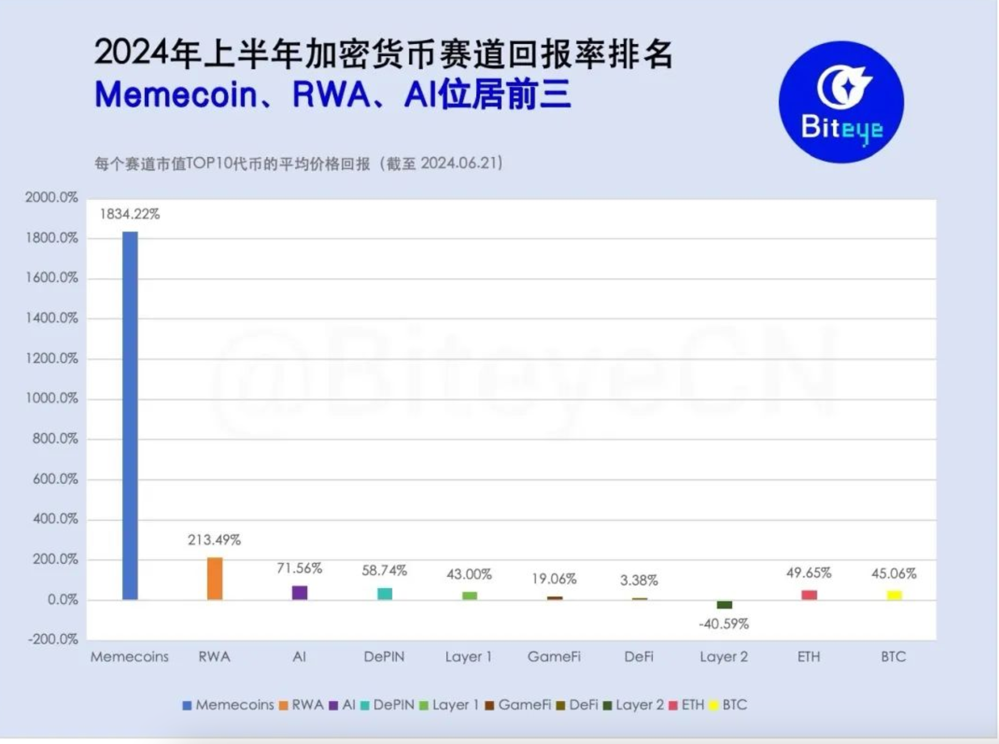

> 币圈炒币，炒的其实是一种新的资产发行方式。而币圈的Alpha，就是如何更早的发现新的资产发行方式。 回顾币圈十几年历史，每一次热点无不如此：、 
>
> 从最早BTC的出现，与其说是一种新型的电子货币，其实是一种以电力和算力为基础的全新资产发行方式。当慢慢大家都看懂BTC以后，BTC的价格已经高攀不起了。后来出现的各种LTC、BCH、比特币钻石等等，虽然可以炒作一时，但是终究还是会走向归零。
>
>  2017年ETH的出现，同样引领了ICO这种全新资产发行方式。刚出现的ETH，V神亲自站台到处兜售却无人问津。但是当ETH百倍之后，各种ICO如雨后春笋般涌现，大都是打着以太坊杀手的旗号，不过最终也是一地鸡毛。 
>
> 2017年底到2018年，随着BNB的出现带火了平台币概念，各大交易所包括OK、火币、GATE等纷纷推出买点卡送平台币的活动，也是一种全新的资产发行方式。再到后来FCOIN交易挖矿的出现更是短时间内引爆了市场，一度交易量是前10大交易所的总和，引得各种山寨交易所一夜之间冒出几百家，甚至有提供一键开交易所的服务。但是高潮过后，除了BNB等少数头部交易所，大部分交易所都倒闭跑路了。
>
>  2019年币安又创新的推出了用BNB打新的全新资产发行模式，一度诞生了像BIT、MATIC等百倍币。OK、火币等交易所也是纷纷跟进这种模式给自家平台币赋能。但是时间到2024年，除了BNB达到上轮牛市高点以外，连OK都放弃给自家OKB赋能了。 
>
> 
>
> 2020年DEFI是又一次区块链的革命，UNI、COMP、AAVE等头部平台的治理代币一度是上轮牛市的热门，各种仿盘也是层出不穷。虽然这些代币除了投票之外没什么功能，但奈何韭菜热情高涨，都认为是可以长期持有的价值币。但是拉长时间来看，除了像我一样坚持做无情的挖提卖的挖矿机器以外，大部分接盘甚至买入去做二池的人都是深度套牢，此生再难回本了。 
>
> 2021年上轮大牛市，上半场马斯克和GAMESTOP带火了MEME土狗概念，紧接着下半场的热点是NFT和GAMEFI，无不是一种看似新鲜，实则换汤不换药的资产发行方式。第一波进去的人吃肉，后进去的人深度套牢。 这一轮还有人讨论NFT和GAMEFI吗？ 猴子都快归零了。 
>
> 2023年大火的BTC生态各种铭文、符文，也无不如此。 币圈每隔一两年都会有一个新的所谓“热点”，其实就是换了马甲的新资产发行方式而已。但大部分热点的持续时间很难超过1年。币圈一天，人间一年。大部分韭菜的生存周期只有6个月。要么亏完离场，要么活下来成为老韭菜。老韭菜有了经验以后就不会再被老的套路骗了，直到出现一种新套路。这也就是为什么大部分“热点”凉了之后，很难再起来的原因。

**加密炒作三板斧：技术创新、资产发行、叙事**

**从铭文到符文，比特币上资产发行标准的范式发展推演** 比特币生态正在变得复杂，减半、[#铭文](https://x.com/hashtag/铭文?src=hashtag_click)、[#符文](https://x.com/hashtag/符文?src=hashtag_click) 和各类 Layer 2 正在紧锣密鼓的进行中，叠加 [#ETF](https://x.com/hashtag/ETF?src=hashtag_click) 通过后的场外资金涌入，一时间风头无两，简单列举一下就有 [#Ordinals](https://x.com/hashtag/Ordinals?src=hashtag_click)、[#Atomicals](https://x.com/hashtag/Atomicals?src=hashtag_click)、[#Stamps](https://x.com/hashtag/Stamps?src=hashtag_click) 和 [#Runes](https://x.com/hashtag/Runes?src=hashtag_click)，继续细分衍生协议就会发现概念有多繁杂。 · ARC-20 · SRC-20 · Runes · BRC-420 · BRC-100/102 不同于常听到的 [#ERC20](https://x.com/hashtag/ERC20?src=hashtag_click) 和 [#ERC721](https://x.com/hashtag/ERC721?src=hashtag_click)，它们俩分别在以太坊取得 FT 和 [#NFT](https://x.com/hashtag/NFT?src=hashtag_click) 的标准定义地位，整个 [#EVM](https://x.com/hashtag/EVM?src=hashtag_click) 生态的都是对其的改造，比特币上的各类协议还在竞争，接下来，我判断，才是具体代币之争。 这种情况在以太坊扩容上已经演示过一次，一般会分为三步： 1. **技术范式竞争**，[#Plasma](https://x.com/hashtag/Plasma?src=hashtag_click)、[#Rollup](https://x.com/hashtag/Rollup?src=hashtag_click)（[#ZK](https://x.com/hashtag/ZK?src=hashtag_click)/[#SNARK](https://x.com/hashtag/SNARK?src=hashtag_click)/[#STARK](https://x.com/hashtag/STARK?src=hashtag_click)、[#OP](https://x.com/hashtag/OP?src=hashtag_click)）、[#状态通道](https://x.com/hashtag/状态通道?src=hashtag_click) 和 [#侧链](https://x.com/hashtag/侧链?src=hashtag_click) 四种，Rollup 路线胜出； 2. **具体协议竞争**，ZK 系 Rollup 

[@zksync](https://x.com/zksync)

 、

[@Starknet](https://x.com/Starknet)

、

[@Scroll_ZKP](https://x.com/Scroll_ZKP)

，OP 系 

[@Optimism](https://x.com/Optimism)

在主网、

[@Arbitrum](https://x.com/Arbitrum)

 One 生态竞争； 3. **完成代币发行**，OP 系龙头率先发币，ZK 系慢随其后。 代币发行之后，各项目基本就会躺平，行业叙事焦点也会变换，这些代币只会在板块轮动时偶尔暴涨或暴跌，才会短暂出现在人们眼中。 推广而言，在 [#DA](https://x.com/hashtag/DA?src=hashtag_click) 竞争、[#DEX](https://x.com/hashtag/DEX?src=hashtag_click) 竞争、去中心化排序器，甚至于公链竞争等所有区块链赛道都会呈现这个规律，这也是我之前认为 [#BTC](https://x.com/hashtag/BTC?src=hashtag_click) L2 会遵循以太坊扩容路线演进的原因。 这个规律会发生在比特币之上吗？

币圈牛市三部曲 

资金流入 资产发行 讲故事,造资产 每轮的牛市基本都围绕这个规律,2020年先是灰度打开资金入口,DeFi挖矿作为一种新的资产发行方式迅速席卷整个币圈有了这个Aha时刻更好的留存用户和资金,再开始讲故事, 造泡沫,千万别管最后是骗局还是创新

市场无数次印证，每次新资产发行方式的出现，都将对Crypto带来巨变   实现Token-NFT双向原生流动(Token-NFT Duality)的混合资产标准：404图币二象性协议！是突破ETH资产边界的新范式 ➟让NFT资产具备原生流动性、碎片化和策略性； ➟让FT资产具备艺术可塑性。

币圈炒币，炒的其实是一种新的资产发行方式。而币圈的Alpha，就是如何更早的发现新的资产发行方式。  回顾每一轮大牛市，都是新的价值点和新的资金模式结合产生的， ico， 新的资金模式；以太链上发行资产 ieo， 新的资金模式，平台币挖矿，发行资产  defi，新的资金模式， 流动性挖矿，发行资产 nft，  新的资金模式，还是发行资产 ordinals， 在大饼的生态里发行资产 所谓 mass adoption，其本质是，需要更好的资产发行方式